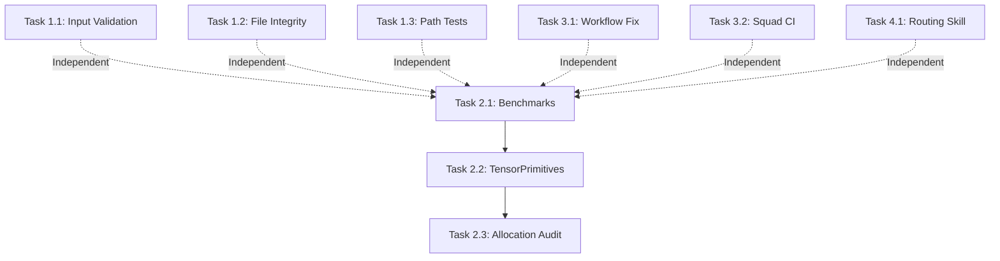

# Issue #1 Triage — Security & Performance Audit

## Summary
Apply security hardening, performance optimizations, CI/Linux fixes, and Squad AI routing conventions learned from LocalEmbeddings v1.1.0 audit to ElBruno.Realtime.

---

## Checklist Assessment

### 🔒 Security

| Item | Status | Current State | Action Required |
|------|--------|---------------|-----------------|
| **Path traversal prevention** | ✅ | Both `WhisperModelManager` and `SileroModelManager` already use `Path.GetFullPath()` + `StartsWith()` validation (lines 48-51 and 30-33 respectively) | ✅ Already implemented, consider adding tests |
| **Cross-platform file name validation** | ⚠️ | No explicit file name character validation found in codebase; current code relies on whitelisted model IDs (Whisper) or fixed filenames (Silero) | ⚠️ Not currently needed (no user-provided filenames), but document as defense-in-depth |
| **Input validation** | ⚠️ | Pipeline constructor has null checks via `ArgumentNullException`. No length limits or format validation on public API entry points (e.g., `ConversationOptions.SessionId`, audio stream validation) | ❌ Add validation for session IDs, audio format constraints |
| **URL validation** | ❌ | HuggingFace downloader (external dependency `ElBruno.HuggingFace.Downloader`) and `WhisperGgmlDownloader` (from Whisper.net) handle downloads — no explicit HTTPS enforcement in this repo | ⚠️ Document that external downloaders are trusted; consider adding integration test to verify HTTPS |
| **File integrity checks** | ❌ | No size/format validation before loading ONNX models or GGML binaries | ❌ Add basic file size sanity checks (min/max bounds) to detect corrupted downloads |

**Security Score:** 2/5 ✅, 2/5 ⚠️, 1/5 ❌

---

### ⚡ Performance

| Item | Status | Current State | Action Required |
|------|--------|---------------|-----------------|
| **TensorPrimitives** | ❌ | No usage of `System.Numerics.Tensors.TensorPrimitives` found. Manual loop in `SileroVadDetector.cs` line 206 (`for (int i = 0; i < floats.Length; i++)`) for audio normalization | ❌ Replace manual loops with `TensorPrimitives` for SIMD acceleration |
| **Span / Memory** | ⚠️ | Some `Span<byte>` usage visible, but no comprehensive hot-path audit conducted | ⚠️ Requires profiling — audit VAD/STT hot paths for array allocations |
| **ArrayPool** | ❌ | No `ArrayPool<T>` usage found in core pipeline or providers | ❌ Profile audio processing loops; pool temp buffers if allocations are hot |
| **Benchmarks** | ❌ | No BenchmarkDotNet projects found | ❌ Add benchmark project to measure VAD, STT, pipeline throughput + allocations |
| **Top-K search** | N/A | No ranking/similarity search in this codebase (pure pipeline orchestration) | N/A |

**Performance Score:** 0/4 ✅, 1/4 ⚠️, 3/4 ❌, 1/4 N/A

---

### 🐧 CI / Linux

| Item | Status | Current State | Action Required |
|------|--------|---------------|-----------------|
| **[SkippableFact] for platform tests** | ✅ | No platform-conditional tests found (no `Skip.If` or `Skip.IfNot` in test suite) | ✅ No action needed (no conditional tests exist) |
| **Cross-platform file name chars** | ✅ | No reliance on `Path.GetInvalidFileNameChars()` found in production or test code | ✅ Already compliant |
| **Publish workflow git tag format** | ⚠️ | `publish.yml` line 36 strips leading `v` but does NOT handle `.1.2.3` typo (stray leading `.`). No version format validation step. | ❌ Add validation step + strip leading `.` as defense |

**CI/Linux Score:** 2/3 ✅, 1/3 ⚠️ (needs fix)

---

### 🤖 Squad AI Team

| Item | Status | Current State | Action Required |
|------|--------|---------------|-----------------|
| **Simple tasks → 0x models** | ❌ | `.github/agents/squad.agent.md` exists but no model routing rules for simple tasks documented in squad skills | ❌ Add skill to `.squad/skills/task-routing/` with model selection heuristics |

**Squad Score:** 0/1 ✅, 1/1 ❌

---

## Overall Assessment

| Category | Score | Priority |
|----------|-------|----------|
| Security | 2/5 ✅, 2/5 ⚠️, 1/5 ❌ | **HIGH** — Input validation and file integrity gaps |
| Performance | 0/4 ❌ | **MEDIUM** — No perf baseline; need benchmarks before optimizing |
| CI/Linux | 2/3 ✅, 1/3 ❌ | **LOW** — One workflow fix (simple) |
| Squad Rules | 0/1 ❌ | **LOW** — Nice-to-have for cost optimization |

**Overall Readiness:** 🟡 Partial — Security hardening and benchmarking infrastructure needed before considering production-ready.

---

## Work Decomposition

### Domain 1: Security Hardening (Priority: HIGH)

**Owner:** Dallas (C# Developer)

#### Task 1.1: Input Validation for Public API
- **File:** `src/ElBruno.Realtime/Options/ConversationOptions.cs`
- **What:** Add validation for `SessionId` property:
  - Length limit (e.g., 256 chars)
  - Character whitelist (alphanumeric + dash/underscore, reject path separators)
  - Null/empty handling documented
- **Tests:** Add `ConversationOptionsTests.cs` with edge cases (empty, null, too long, path traversal attempts)

#### Task 1.2: File Integrity Checks for Model Downloaders
- **Files:** 
  - `src/ElBruno.Realtime.Whisper/WhisperModelManager.cs`
  - `src/ElBruno.Realtime.SileroVad/SileroModelManager.cs`
- **What:** After download, validate file size is within expected bounds:
  - Whisper models: min 10KB, max 2GB (conservative bounds)
  - Silero VAD: min 100KB, max 50MB
  - Throw `InvalidOperationException` with clear message if out of bounds
- **Tests:** Mock downloader to return zero-byte or huge files; verify exception

#### Task 1.3: Path Traversal Test Coverage
- **File:** `src/ElBruno.Realtime.Tests/ModelManagerSecurityTests.cs` (new)
- **What:** Test that `..` and absolute paths in `cacheDir` are rejected:
  - `WhisperModelManager.EnsureModelAsync(cacheDir: "../attacker")`
  - `SileroModelManager.EnsureModelAsync(cacheDir: "C:\\Windows\\System32")`
  - Verify `ArgumentException` thrown
- **Why:** Kane identified this gap in original analysis; defense exists but never tested

#### Task 1.4: Document External Download Security Posture
- **File:** `README.md` (Security section)
- **What:** Add section documenting:
  - Model sources (HuggingFace, Whisper.net)
  - HTTPS used by default (via dependencies)
  - First-run download requirements
  - Offline usage after models cached
- **Why:** Transparency for security-conscious users

---

### Domain 2: Performance — Baseline & Optimizations (Priority: MEDIUM)

**Owner:** Dallas (Implementation), Kane (Benchmarks)

#### Task 2.1: Add BenchmarkDotNet Project
- **Files:** 
  - `src/ElBruno.Realtime.Benchmarks/ElBruno.Realtime.Benchmarks.csproj` (new)
  - `src/ElBruno.Realtime.Benchmarks/VadBenchmark.cs`
  - `src/ElBruno.Realtime.Benchmarks/SttBenchmark.cs`
  - `src/ElBruno.Realtime.Benchmarks/PipelineBenchmark.cs`
- **What:** 
  - Measure throughput (audio frames/sec) for VAD detection
  - Measure latency (ms) for STT transcription
  - Measure allocations (bytes) for one full pipeline turn
  - Use synthetic audio (1-5 second clips, fixed sample rate)
- **Why:** Establish baseline before optimizing (avoid premature optimization)
- **Tests:** Benchmarks are self-validating; include in `dotnet build` but not `dotnet test`

#### Task 2.2: Optimize SileroVadDetector with TensorPrimitives
- **File:** `src/ElBruno.Realtime.SileroVad/SileroVadDetector.cs`
- **What:** Replace manual loop (line 206) with `TensorPrimitives.Divide()` for audio normalization:
  - Before: `for (int i = 0; i < floats.Length; i++) floats[i] /= 32768f;`
  - After: `TensorPrimitives.Divide(floats, 32768f, floats);`
  - Add `<PackageReference Include="System.Numerics.Tensors" />` to csproj
- **Why:** SIMD acceleration for vector operations (2-10x faster on AVX2/NEON)
- **Tests:** Existing `SileroVadTests` should still pass; add benchmark to verify perf gain

#### Task 2.3: Hot-Path Allocation Audit (Optional, After Benchmarks)
- **Files:** TBD based on benchmark results
- **What:** Profile with `dotnet-trace` or BenchmarkDotNet memory diagnoser:
  - Identify top allocators
  - Replace `byte[]` allocations with `ArrayPool<byte>` where appropriate
  - Use `Span<byte>` instead of `byte[]` for temp buffers
- **Why:** Only optimize if benchmarks show allocations are a bottleneck
- **Tests:** Benchmark suite should show reduction in Gen0/Gen1/Gen2 collections

---

### Domain 3: CI Workflow Hardening (Priority: LOW)

**Owner:** Parker (DevOps)

#### Task 3.1: Publish Workflow Version Validation
- **File:** `.github/workflows/publish.yml`
- **What:** 
  - Line 36: Update version stripping to handle `.` prefix typo:
    ```bash
    VERSION="${VERSION#v}"     # v1.2.3 → 1.2.3
    VERSION="${VERSION#.}"     # .1.2.3 → 1.2.3
    ```
  - Add validation step after version determination:
    ```yaml
    - name: Validate version format
      run: |
        if ! [[ "${{ steps.version.outputs.version }}" =~ ^[0-9]+\.[0-9]+\.[0-9]+(-[a-z0-9.]+)?$ ]]; then
          echo "❌ Invalid version format: ${{ steps.version.outputs.version }}"
          echo "Expected: X.Y.Z or X.Y.Z-preview"
          exit 1
        fi
        echo "✅ Version format valid: ${{ steps.version.outputs.version }}"
    ```
- **Why:** Fail-fast with clear error message instead of silent corruption
- **Tests:** Manual trigger with `v.1.2.3` tag (mock) to verify validation catches it

#### Task 3.2: Enable Squad CI for dotnet
- **File:** `.github/workflows/squad-ci.yml`
- **What:** Replace TODO (lines 21-28) with actual build/test commands:
  ```yaml
  - name: Build and test
    run: |
      dotnet restore
      dotnet build --no-restore --configuration Release
      dotnet test --no-build --configuration Release --verbosity normal
  ```
- **Why:** Enable CI on PR merges to `dev`/`preview`/`main` branches
- **Tests:** Open a test PR to `dev` branch and verify workflow runs

---

### Domain 4: Squad AI Skill — Model Routing (Priority: LOW)

**Owner:** Ripley (Lead)

#### Task 4.1: Add Task Routing Skill
- **File:** `.squad/skills/task-routing/SKILL.md` (new)
- **What:** Document model selection heuristics:
  - **gpt-5-mini / claude-haiku-4.5**: Typo fixes, renaming, changelog updates, version bumps, simple refactoring
  - **Standard models (Sonnet, GPT-5.x)**: Feature implementation, bug fixes, architecture changes
  - **Premium models (Opus)**: Complex multi-file refactoring, performance optimization, security audits
  - Include examples for each tier
- **Why:** Cost optimization — route simple tasks to fast/cheap models
- **Tests:** None (heuristic guide for human orchestrator or future auto-routing)

---

## Coordination Plan

### Execution Order

```
Phase 1 (Parallel):
  - Dallas → Security Tasks 1.1, 1.2, 1.3 (1-2 days)
  - Kane → Benchmark Project 2.1 (1 day)
  - Parker → CI Fixes 3.1, 3.2 (2 hours)
  - Ripley → Squad Skill 4.1 (30 minutes)

Phase 2 (Sequential, after Phase 1):
  - Dallas → TensorPrimitives Optimization 2.2 (requires benchmarks from Kane)
  - Kane → Validate perf gains with updated benchmarks

Phase 3 (Optional, if benchmarks justify):
  - Dallas → Hot-path allocation audit 2.3 (requires benchmark data)
```

### Dependencies



### Owner Allocation

| Agent | Tasks | Effort | Criticality |
|-------|-------|--------|-------------|
| **Dallas** (C# Dev) | 1.1, 1.2, 2.2, (2.3 optional) | 2-3 days | HIGH (security + perf) |
| **Kane** (Tester) | 1.3, 2.1 | 1-2 days | HIGH (benchmarks critical) |
| **Parker** (DevOps) | 3.1, 3.2 | 2-3 hours | LOW (workflow polish) |
| **Ripley** (Lead) | 1.4, 4.1 | 1-2 hours | LOW (docs + conventions) |

### Review Gates

1. **Security PR (1.1-1.3)**: Must be reviewed by Kane (tests) + Ripley (design) before merge
2. **Performance PR (2.1-2.3)**: Must include benchmark results in PR description; Dallas self-review OK if benchmarks show improvement
3. **CI PR (3.1-3.2)**: Parker self-merge after manual workflow test
4. **Skill PR (4.1)**: Ripley self-merge (conventions doc)

---

## Risks & Mitigations

### Risk 1: TensorPrimitives Breaks ONNX Runtime Compatibility
- **Likelihood:** Low
- **Impact:** High (VAD breaks completely)
- **Mitigation:** 
  - Task 2.2 MUST include existing test suite passing as gate
  - Add benchmark comparison before/after to validate correctness + perf gain
  - Keep original code commented for rollback

### Risk 2: Benchmarks Show No Allocations Worth Pooling
- **Likelihood:** Medium
- **Impact:** Low (Task 2.3 skipped, no wasted effort)
- **Mitigation:** 
  - Task 2.3 explicitly marked as "Optional, data-driven"
  - Kane documents findings even if no action needed

### Risk 3: Input Validation Too Strict, Breaks Existing Users
- **Likelihood:** Low (SessionId is new in v1.1.0 per decisions.md)
- **Impact:** Medium (breaking change)
- **Mitigation:**
  - Task 1.1 validation should be **permissive** initially (log warnings, don't throw)
  - Document in CHANGELOG as "hardening" not "breaking change"
  - Consider grace period (v1.2 warns, v1.3 throws)

---

## Follow-Up Issues

These items were noted but are OUT OF SCOPE for this issue:

1. **Full integration tests** (VAD→STT→LLM→TTS end-to-end) — Kane noted this in original analysis, but requires mock LLM + CI budget
2. **QwenTTS streaming latency** — Noted in decisions.md as "fake streaming" but is library limitation, not fixable here
3. **Pipeline tests** — Kane's gap analysis shows `RealtimeConversationPipeline` has zero tests; should be separate issue (needs mocking strategy)

Recommend creating follow-up issues after this audit is complete.

---

## Success Criteria

✅ Issue #1 considered complete when:

1. All ❌ items in Security section addressed (input validation, file integrity checks, tests)
2. Benchmark project created with baseline numbers documented
3. At least one perf optimization implemented (TensorPrimitives) with before/after benchmarks
4. CI workflow hardened (version validation + Squad CI enabled)
5. All new code has tests (target: 80%+ coverage for new files)
6. README updated with security posture section
7. No regressions in existing 80 tests (66 original + 14 session store)

---

## Timeline Estimate

- **Phase 1 (Parallel):** 2-3 days
- **Phase 2 (Sequential):** 1-2 days
- **Total:** 3-5 days (assuming 1 full-time equivalent across 4 agents)

**Target Completion:** End of week following triage (March 7, 2026)

---

## Notes for Execution

1. **Branch strategy:** Create feature branch `feature/security-perf-audit` from `dev`
2. **PR structure:** Can do one mega-PR or split by domain (security, perf, ci, docs) — recommend split for easier review
3. **Benchmark CI:** Do NOT run benchmarks in CI on every commit (too slow); manual trigger or nightly only
4. **LocalEmbeddings reference:** If implementation questions arise, check `elbruno/elbruno.localembeddings` PR #37 for examples

---

**Triage complete. Ready for team assignment and execution.**
